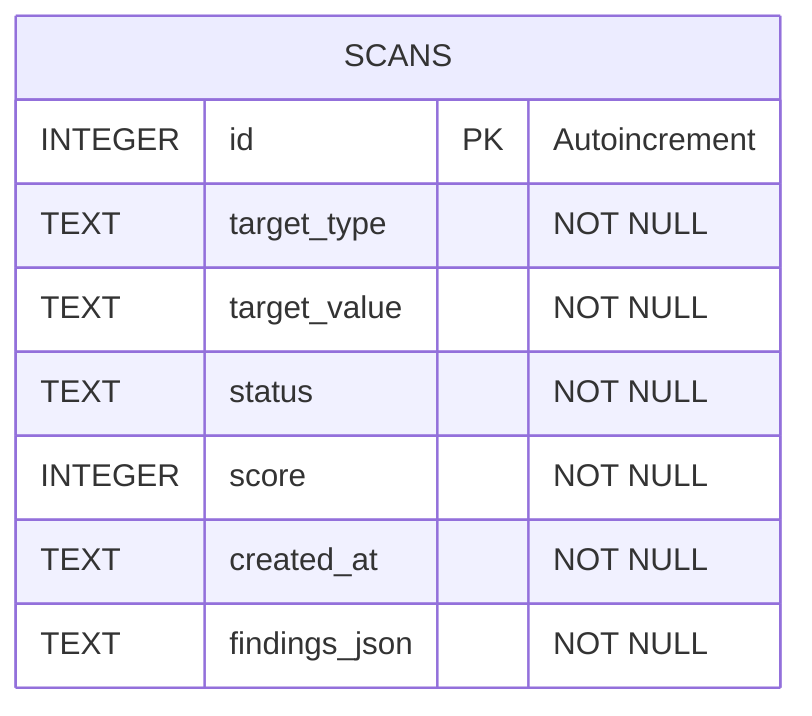

# FD07 - Diccionario de Datos

**UNIVERSIDAD PRIVADA DE TACNA**

**FACULTAD DE INGENIERÍA**

**Escuela Profesional de Ingeniería de Sistemas**

**Proyecto:** Sistema Verificador de Cumplimiento OWASP

Curso: Calidad y Pruebas de Software

Docente: Patrick Jose Cuadros Quiroga

Integrantes:
- Andia Navarro, Diego Fabrizio - 2022073906
- Concha Llaca Gerardo Alejandro - 2017057849

Tacna – Perú

2026

---

## CONTROL DE VERSIONES

| Versión | Hecha por | Revisada por | Aprobada por | Fecha | Motivo |
|---|---|---|---|---|---|
| 1.0 | Equipo | Profesor | - | 24/06/2026 | Versión inicial del diccionario de datos |

---

## 1. Introducción
Este documento detalla el diseño de almacenamiento de datos del **Sistema Verificador de Cumplimiento OWASP**. El sistema utiliza una base de datos ligera e independiente llamada **SQLite3**, configurada y administrada mediante el archivo [store.py](file:///c:/Users/Equipo/Downloads/proyecto-si784-2026-i-u1-verificador-de-cumplimiento-de-owasp-main/app/store.py). El almacenamiento persistente se ubica en el archivo `data/scans.sqlite3`.

---

## 2. Diagrama de la Base de Datos (Estructura de Almacenamiento)
La base de datos consta de una tabla principal llamada `scans` que encapsula la información de cada auditoría de seguridad realizada y almacena sus hallazgos de forma serializada.



---

## 3. Diccionario de Datos

### Tabla: `scans`
La tabla `scans` registra el historial de análisis de seguridad solicitados por los usuarios, ya sea de fragmentos de código, URLs, archivos cargados o repositorios de GitHub.

| Nombre del Campo | Tipo de Dato | Llave | Restricciones | Descripción / Notas |
| :--- | :--- | :---: | :--- | :--- |
| **id** | INTEGER | PK | PRIMARY KEY, AUTOINCREMENT | Identificador numérico único y correlativo para cada análisis realizado. |
| **target_type** | TEXT | - | NOT NULL | Indica el tipo de análisis. Valores admitidos: `'code'`, `'url'`, `'archivo'`, `'github_repo'`. |
| **target_value** | TEXT | - | NOT NULL | Representa el valor escaneado. Ej: código fuente copiado, URL de la página, ruta local del archivo o URL de GitHub. |
| **status** | TEXT | - | NOT NULL | Estado del proceso de escaneo. Ejemplos comunes: `'completed'`, `'failed'`, `'error'`. |
| **score** | INTEGER | - | NOT NULL | Calificación de cumplimiento de seguridad (de 0 a 100) calculada tras descontar penalizaciones. |
| **created_at** | TEXT | - | NOT NULL | Fecha y hora en formato ISO 8601 (UTC) en que se creó el registro del escaneo. |
| **findings_json** | TEXT | - | NOT NULL | Cadena formateada en JSON con el listado detallado de todos los hallazgos (`Finding`) asociados a este análisis. |

---

### Índices de la Tabla `scans`
Para optimizar las consultas y la visualización de resultados históricos (dashboard y listados), se define un índice en la fecha de creación:

| Nombre del Índice | Campo indexado | Tipo | Propósito |
| :--- | :--- | :--- | :--- |
| `idx_scans_created_at` | `created_at` | DESC (Orden descendente) | Acelera la búsqueda de los escaneos más recientes en el panel web y reportes API. |

---

## 4. Estructura Serializada del Campo `findings_json`
Los hallazgos (`findings`) asociados a un escaneo se guardan directamente en el campo `findings_json` como un arreglo de objetos JSON para simplificar el modelo relacional. Cada elemento dentro del JSON estructurado responde a los siguientes atributos:

| Atributo JSON | Tipo de Dato | Descripción / Ejemplos |
| :--- | :--- | :--- |
| **rule_id** | String | Código identificador del patrón OWASP evaluado (ej. `"OWASP-A02"`, `"OWASP-A06-CVE"`). |
| **title** | String | Título descriptivo del riesgo detectado (ej. `"Fallas Criptográficas - Exposición de Secretos"`). |
| **severity** | String | Nivel de gravedad del hallazgo. Valores posibles: `"high"`, `"medium"`, `"low"`. |
| **description** | String | Detalle de la regla vulnerada y el peligro potencial. |
| **evidence** | String | Fragmento del código, cabecera ausente o línea exacta de código que detonó la regla. |
| **penalty** | Integer | Penalización numérica descontada del score de seguridad general (ej. 30 para high, 15 para medium, 5 para low). |
| **remediation** | String | Pasos de solución sugeridos al desarrollador para corregir la vulnerabilidad. |

#### Ejemplo de contenido en `findings_json`:
```json
[
  {
    "rule_id": "OWASP-A02",
    "title": "Fallas Criptográficas - Exposición de Secretos",
    "severity": "high",
    "description": "Secretos, contraseñas o claves hardcodeadas detectadas en el código.",
    "evidence": "Coincidencia encontrada: password = \"secreto\"",
    "penalty": 30,
    "remediation": "1. Nunca hardcodear secretos\n2. Usar variables de entorno (os.getenv())\n3. Implementar secret manager (Azure Key Vault, HashiCorp Vault)\n4. Rotar credenciales regularmente"
  }
]
```
